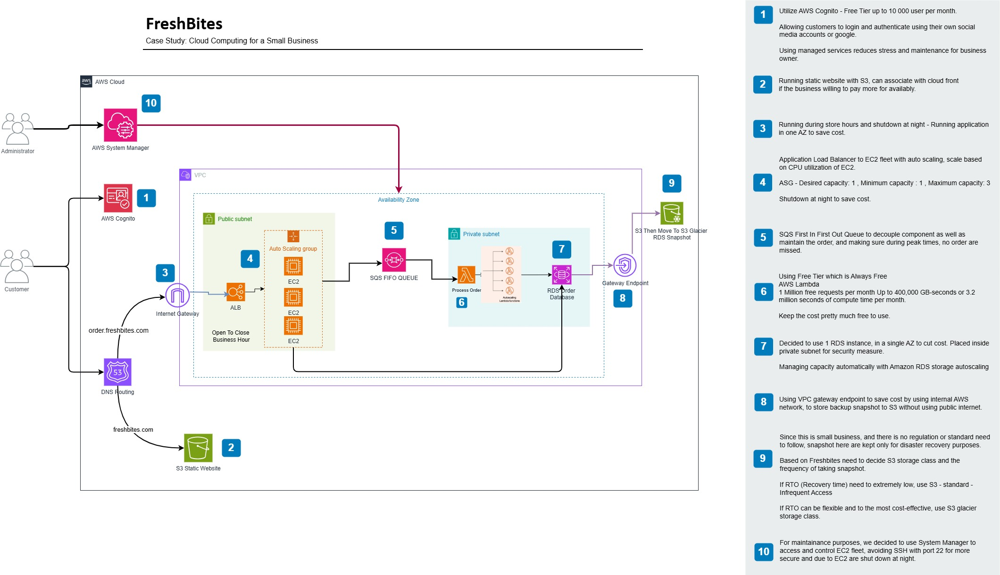

# 🍞 FreshBites Cloud Architecture

## 📌 Overview
FreshBites is a small bakery that has recently launched an online ordering system for customers to place pickup and delivery orders. To enhance reliability, security, and scalability, we have migrated the system to AWS.

## 📊 Architecture Diagram
This architecture is designed to ensure high availability, security, and efficient order processing.  

  

### **Key Components:**  
1. **AWS Cognito** → Secure user authentication.  
2. **Application Load Balancer (ALB)** → Distributes traffic across EC2 instances.  
3. **Auto Scaling Group (EC2 Instances)** → Handles dynamic workloads and scales as needed.  
4. **SQS FIFO Queue** → Ensures orders are processed in sequence.  
5. **AWS Lambda** → Processes incoming orders asynchronously.  
6. **Amazon RDS (Order Database)** → Stores customer orders securely.  
7. **AWS S3 Glacier** → Backup storage for database snapshots.  
8. **VPC with Public & Private Subnets** → Ensures network segmentation and security.  
9. **Gateway Endpoint** → Securely connects private resources to S3 without internet exposure.  

## 🔧 AWS Services Used
- **Compute:** EC2 (Auto Scaling), AWS Lambda  
- **Storage:** Amazon RDS, S3 Glacier  
- **Networking:** VPC, Internet Gateway, ALB, Gateway Endpoint  
- **Messaging:** Amazon SQS (FIFO)  
- **Security:** AWS Cognito, IAM, Security Groups, AWS KMS  
- **Administration:** AWS System Manager  

## 🔒 Security Enhancements
✅ **Private Subnet for Database & Processing** → Protects critical data from external threats.
✅ **AWS Cognito with MFA** → Ensures secure authentication.
✅ **AWS KMS Encryption** → Encrypts RDS and S3 data.

## ⚡ Benefits of This Cloud Solution
- **Scalability:** Auto Scaling ensures the system handles peak traffic efficiently.  
- **Reliability:** ALB & Auto Scaling Group along with Lambda serverless architecture improve uptime and redundancy.  
- **Security:** Private networking, IAM, encryption, and authentication enhancements.  
- **Cost Optimization:** Serverless functions (Lambda), S3 Glacier for backups, and Auto Scaling reduce unnecessary costs.  

## ⚠️ Potential Challenges
- **Initial Cloud Migration Cost:** Setting up and optimizing AWS services may require an initial investment.  
- **Complexity of Infrastructure Management:** Requires knowledge of AWS best practices for ongoing maintenance.  
- **Vendor-Locked-In:** This Architecture heavily ultilize AWS services and AWS Free tier, if anything chagnes relating to pricing model, it will be a problem to the business owner. 
